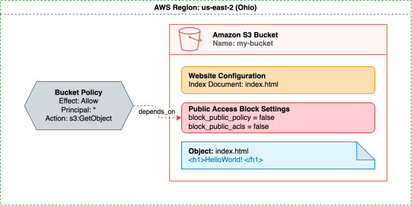
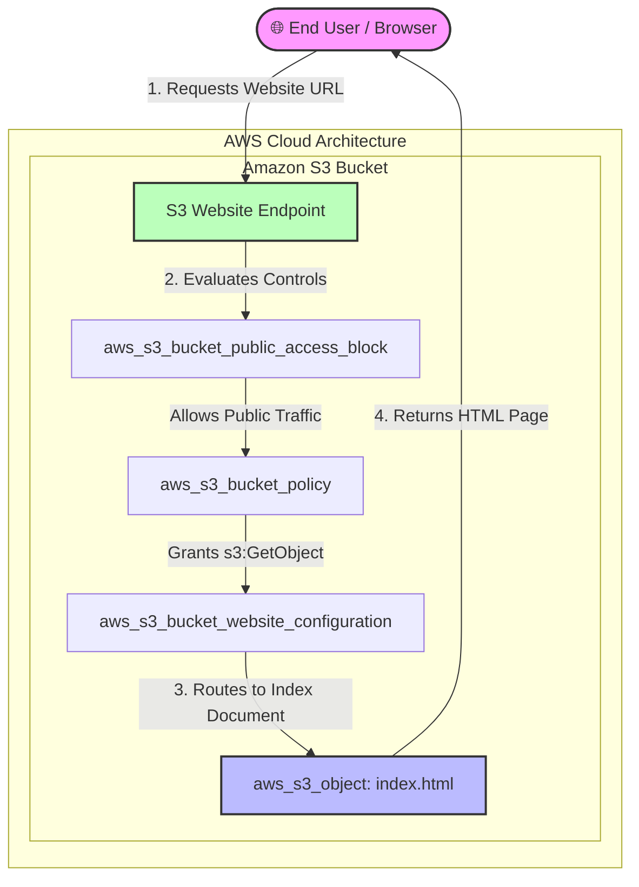

### 🌐 Host a Static Website on AWS using Terraform

This repository contains the Infrastructure as Code (IaC) configuration to deploy a secure, publicly accessible static website on AWS using **Amazon S3** and **Terraform**. 

---

### 🏗️ Architecture Overview

The infrastructure deploys a fully serverless static website hosting environment by orchestrating the following AWS resources:

*   **`aws_s3_bucket`**: Creates the foundational storage bucket to host the website source files.
*   **`aws_s3_bucket_website_configuration`**: Configures the bucket for website hosting, defining the index document (e.g., `index.html`) and error document paths.
*   **`aws_s3_bucket_public_access_block`**: Explicitly manages public access controls (Block Public Access settings) to allow public read permissions specifically for website hosting.
*   **`aws_s3_bucket_policy`**: Attaches a JSON bucket policy allowing public standard read access (`s3:GetObject`) so users can load the website files.
*   **`aws_s3_object`**: Manages the upload and content delivery of the `index.html` file into the root of the S3 bucket.



---

### 🚀 Getting Started

#### Prerequisites
*   [Terraform](https://hashicorp.com) (v1.0+) installed locally.
*   An active **AWS Account** with configured credentials (`aws configure`).

#### Deployment Steps
1.  **Initialize the directory** to download the required AWS provider plugins:
    ```bash
    terraform init
    ```
2.  **Preview the execution plan** to verify the resources that will be built:
    ```bash
    terraform plan
    ```
3.  **Provision the infrastructure** to AWS:
    ```bash
    terraform apply
    ```
4.  **Access your site**: Once deployment completes, Terraform outputs the generated S3 website endpoint URL. Open it in any browser to see your live site!

---

### 📊 Infrastructure Data Flow


